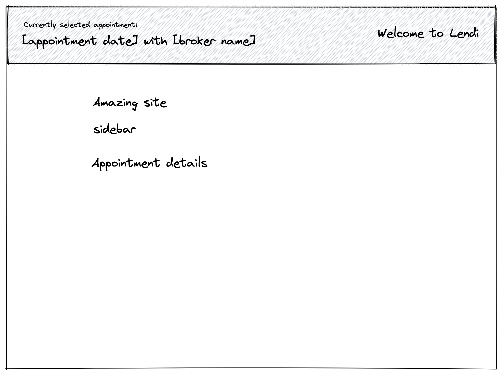
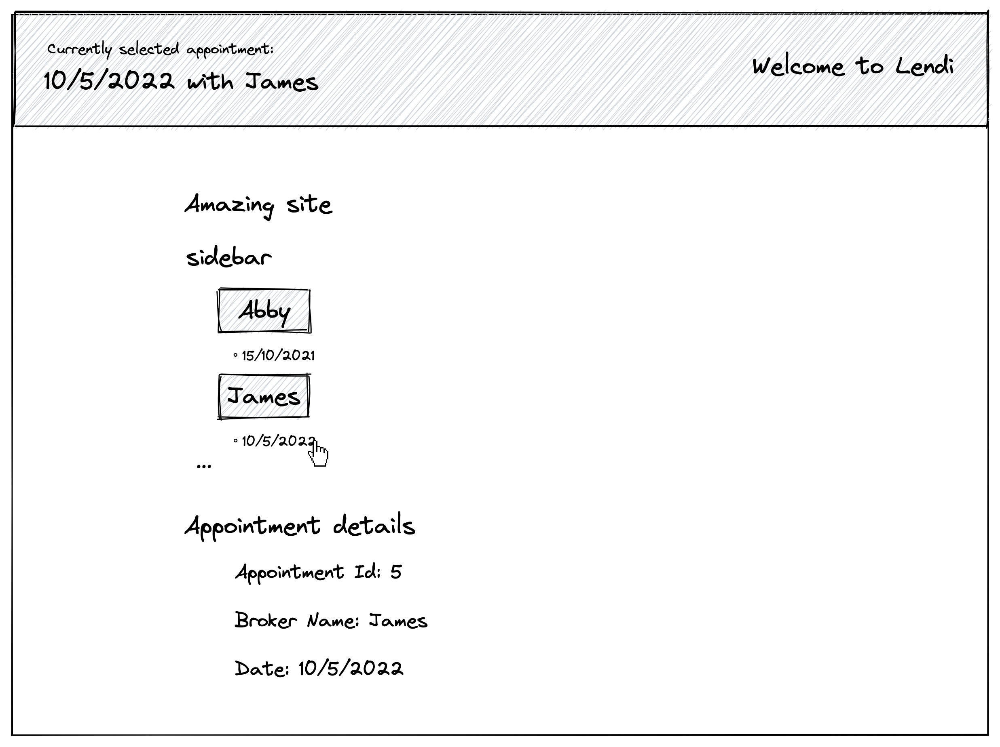
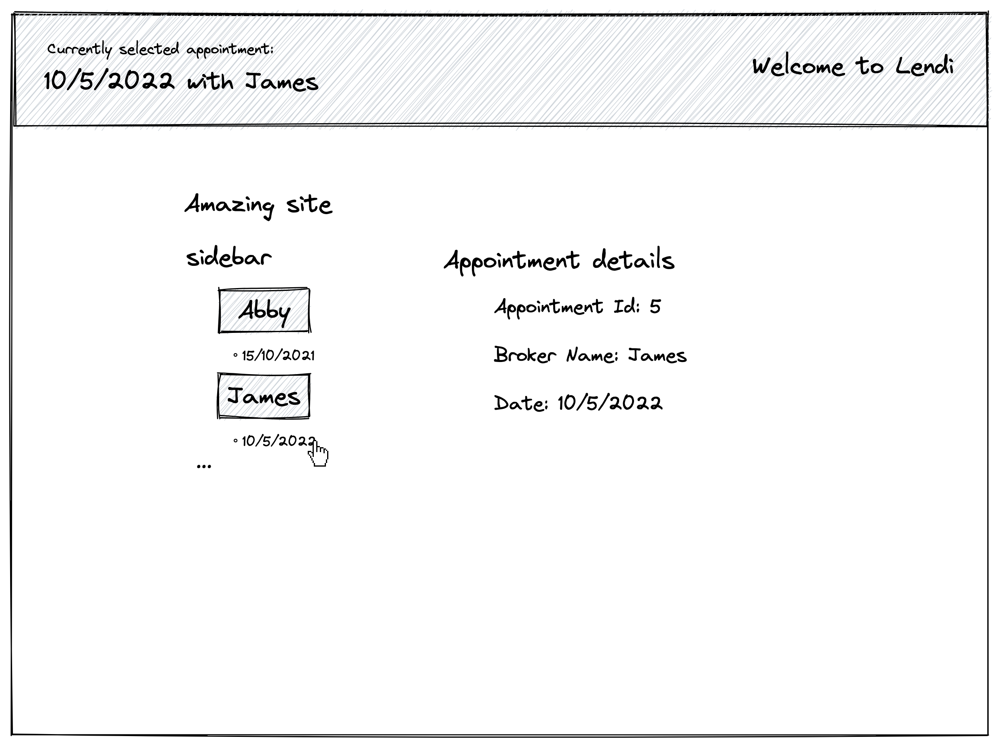

## Welcome to the Lendi Frontend Pairing Test
This test is to be completed during a pairing session with one of our Frontend engineers. The goal is to understand how you approach problems, collaborate, and communicate similar to how you do normally on a day-to-day basis. You may not have time to complete all the tasks during the session, which is completely fine.

Please do not complete these tasks ahead of the pairing session, but instead use this time to read through and familiarise yourself with the code and tasks prior to meeting with us. If you have any questions about the test or any of these tasks feel free to ask for clarification.

## Info

./services is the backend API

./app is a frontend app

## How to run this

First of all, start the API

`cd ./services && yarn && yarn start`

Then start the app

`cd ./app && yarn && yarn start`

## The test

You'll start with the app not showing any data

#### Task 1: Populate the site with brokers and appointments, and show the appointment which is grouped by brokers on the sidebar

- You will be able to call the two APIs to get the brokers and the appointments data when you start the service.

- http://localhost:8080/brokers

- http://localhost:8080/appointments

- ps. you can use axios library to get the data which is pre-install in this project.

#### Task 2: Show the broker name in the order from A to Z on the sidebar

#### Task 3: Show appointment details on right hand side when clicking on an appointment

#### Task 4: Show appointment details on top navigation when clicking on an appointment

- This is the example when you finish task 1 - 4:

#### Task 5: Refactor implementation to address bad practice (Broker.tsx)

#### Task 6: Update to use the correct semantic tag (Broker.tsx)

#### Task 7: Update AppointmentDetail to be displayed next to SideBar (AppointmentSelect.tsx)

#### Task 8: Complete unit test in ./app/src/components/AppointmentSelect/Broker

#### Task 9

1. How would you improve this codebase?
2. What kind of tooling would you use in this repo to help developers collaborate?
